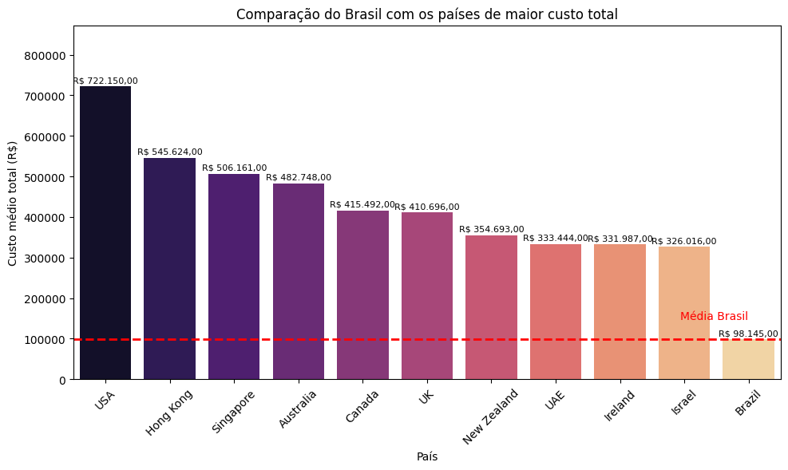

# 🌐 Análise Comparativa de Custo da Educação Internacional

Este projeto tem como objetivo analisar e comparar o custo total de educação internacional entre diferentes países, com foco em estudantes internacionais. A análise destaca a posição do Brasil em relação aos 10 países com os maiores custos.

# 📁 Dataset Utilizado

Fonte: Kaggle (Cost of International Education)

Colunas utilizadas:
Country, University, Level, Duration_Years, Tuition_USD, Rent_USD, Insurance_USD, Exchange_Rate (para referência)

# ⚙️ Etapas do Projeto

## Importação e filtragem das colunas relevantes

Conversão de valores monetários para BRL utilizando cotação atual via AwesomeAPI

Criação da coluna Custo_Total_BRL, que considera:

Mensalidade total do curso

Aluguel mensal multiplicado pelo tempo do curso

Seguro anual multiplicado pelo tempo do curso

Exportação dos dados tratados para CSV

Visualizações com Matplotlib e Seaborn

# 🔍 Visualização Destacada

## Comparativo de Custo Total entre Brasil e Top 10 países mais caros:

A média brasileira é de R$ 98.145

Os EUA lideram com média de R$ 722.150, mais de 7x superior

Países como Irlanda e Israel também têm custo significativamente maior

# 🧰 Principais Insights

O Brasil possui um dos menores custos médios totais de educação internacional entre os países analisados.

Estudar nos EUA, Hong Kong ou Singapura pode custar entre 5 a 7 vezes mais do que no Brasil.

Mesmo países considerados "acessíveis" como Irlanda e Israel ainda representam um custo 3x maior.

O Brasil é uma alternativa financeiramente vantajosa para estudantes locais e internacionais.

# 📚 Tecnologias Utilizadas

Python 3.12

Pandas, NumPy

Matplotlib, Seaborn

Requests, locale

# 💾 Como Reproduzir

1. Clone este repositório: 
git clone https://github.com/seuusuario/custo-educacao-internacional.git

2. Instale as dependências:
pip install -r requirements.txt

Execute o notebook notebooks/analise_educacao.ipynb
Certifique-se de estar com acesso à internet para obter a cotação atualizada do dólar.
